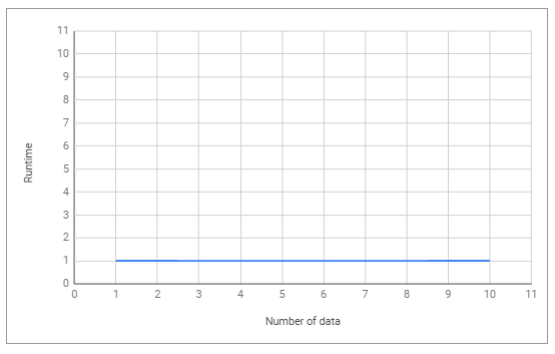

# Big O Notation


Source : https://www.bigocheatsheet.com/

> Big-O notation is a way of converting the overall steps of an algorithm into algebraic terms, then excluding lower order constants and coefficients that don’t have that big an impact on the overall complexity of the problem.

In plain words, Big O notation describes the complexity of your code using algebraic terms. Big O only look at the
factors that have the most impact on the value generated by the algorithm.

Example :

```
Regular       Big-O
2             O(1)   --> It's just a constant number
2n + 10       O(n)   --> n has the largest effect
5n^2          O(n^2) --> n^2 has the largest effect
```

Big O is also divided into two, namely time complexity and space complexity.

There are several kinds of Big O complexity, including:

## 1. Constant or Big O(1)

See example code [here.](src/main/java/aryahmph/BigOImpl.java)

```java
public class BigOImpl implements BigO {
    public void constant() {
        System.out.println("Learn");
        System.out.println("Data Structure");
        int x = 10;
        x *= 100;
        System.out.println(x);
    }
}
```

The above function has the time complexity O(1), because the code is only done one way, even if there are 5 processes in
the code that is calculated O(5) but can be simplified to O(1) because it is only calculated the outline is not the
number of steps.

```text
Output :
Learn
Data Structure
1000
```

<br>



## 2. Linear or Big O(n)

See example code [here.](src/main/java/aryahmph/BigOImpl.java)

```java
public class BigOImpl implements BigO {
    public void linear(int n) {
        for (int i = 0; i < n; i++) {
            System.out.println(i);
        }
    }
}
```

The above function has the time complexity O(n), because it will do as many commands as n. If linear(5) it will provide
output as follows:

```text
Output :
0
1
2
3
4
```

And the greater the n value the greater the time or step it takes.

<br>


## 4. Square or Big O(n²)

See example code [here.](src/main/java/aryahmph/BigOImpl.java)

```java
public class BigOImpl implements BigO {
    public void square(int n) {
        for (int i = 0; i < n; i++) {
            for (int j = 0; j < n; j++) {
                System.out.println(i + "," + j);
            }
        }
    }
}
```

The above function has the time complexity O(n²), because it will do as many commands as n*n. If square(4) it will
provide output as follows:

